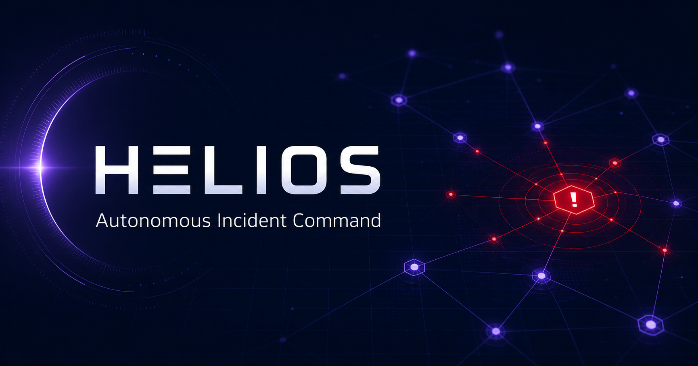

# HELIOS — Autonomous Incident Command

HELIOS is an interactive incident-response simulator that turns a production outage into a visual, explainable workflow: detect the blast radius, correlate traces and deploys, review an evidence-ranked remediation plan, execute a safe rollback, and watch the system recover.

It is intentionally built as a recruiter-facing product demo rather than a static dashboard. The interface has a complete incident state machine, keyboard-accessible command palette, inspectable service topology, correlated event timeline, verified runbook, live telemetry, responsive layouts, and a replayable recovery sequence.

## Why this project stands out

- **Strong systems story:** observability, distributed traces, SLOs, service dependencies, blast-radius analysis, and safe remediation.
- **Real interaction design:** the main action progresses through review, execution, and recovery states; every core control changes the experience.
- **Evidence with guardrails:** recommendations expose confidence, scope, supporting signals, and human confirmation instead of presenting a magic black box.
- **Production-minded delivery:** TypeScript, React 19, accessible semantics, responsive CSS, social metadata, and a portable standalone container.

## Try the incident flow

1. Select services in the topology to inspect their current signals.
2. Open **Timeline** to see how traces, a deploy, and a configuration diff were correlated.
3. Open **Runbook** to inspect the verified rollback plan.
4. Choose **Review & Execute**, confirm the rollback, and watch the metrics recover.
5. Press `Ctrl/Cmd + K` at any time to use the command palette.

## Architecture

```text
Synthetic telemetry + deploy events
                │
                ▼
       Correlation / evidence model
          │          │          │
          ▼          ▼          ▼
      Topology    Timeline    Runbook
          └──────────┬──────────┘
                     ▼
           Incident state machine
     detected → review → executing → resolved
                     │
                     ▼
            Responsive command UI
```

The demo keeps telemetry deterministic so the full story can be evaluated without credentials or external services. A production extension would stream OpenTelemetry data into a graph store, score deploy-to-anomaly correlations, and execute policy-gated workflows through an orchestration service.

## Run with Docker

```bash
docker compose up --build
```

Open `http://localhost:3000`. Stop the service with `docker compose down`.

To run the image without Compose:

```bash
docker build -t project-helios .
docker run --rm -p 3000:3000 -e SITE_URL=http://localhost:3000 project-helios
```

Set `SITE_URL` to the externally reachable origin when serving behind a domain.

## Run with Node.js

```bash
npm ci
npm run dev
```

Exercise the production server with:

```bash
npm run build
npm start
```

## Resume-ready bullets

- Built **HELIOS**, an interactive incident-command simulator that visualizes distributed-service blast radius, correlates 1.8M synthetic traces with deployment changes, and guides operators through policy-gated remediation.
- Designed a typed incident state machine and responsive command interface in React/TypeScript, including topology inspection, evidence timelines, verified runbooks, live metric transitions, keyboard workflows, and replayable recovery.
- Shipped a portable standalone container with accessible controls, social sharing metadata, health checks, and sub-second client interactions.

## Interview talking points

- Why human approval is required for high-blast-radius actions.
- How confidence should be calibrated and displayed in evidence-assisted operations.
- How to model a service graph and calculate downstream impact.
- How OpenTelemetry traces, deploy events, and configuration diffs can be correlated.
- How to evolve the simulator into a real event-driven platform without coupling the UI to a specific observability vendor.
